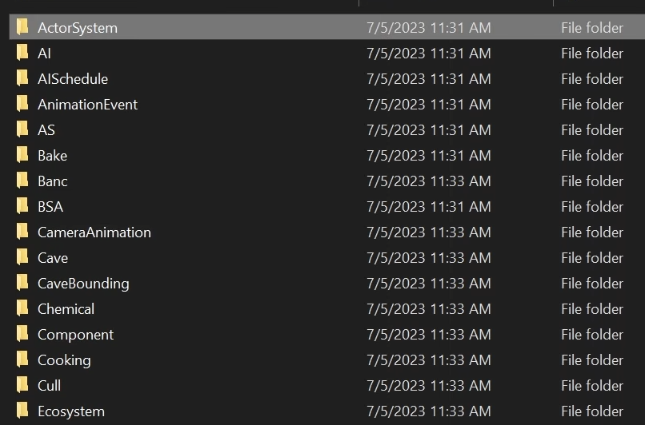

# Modding TotK with C# Tutorial

This is the written tutorial for a [video tutorial I made](https://youtu.be/pKMcCp1WjoU).

---

- [Modding TotK with C# Tutorial](#modding-totk-with-c-tutorial)
- [Tools \& Setup](#tools--setup)
  - [IDE or Text Editor](#ide-or-text-editor)
  - [Other Software](#other-software)
  - [Adding MinGW and Ninja to the PATH](#adding-mingw-and-ninja-to-the-path)
    - [Windows](#windows)
- [NX-Editor Setup](#nx-editor-setup)
- [Creating the C# Project](#creating-the-c-project)
- [Setting up libraries (Part 1, git)](#setting-up-libraries-part-1-git)
  - [Initializing a Repository](#initializing-a-repository)
- [Setting up libraries (Part 1, cs-oead)](#setting-up-libraries-part-1-cs-oead)
  - [Cloning cs-oead](#cloning-cs-oead)
  - [Adding the project reference](#adding-the-project-reference)
- [Add Project Reference \& Load CsOead](#add-project-reference--load-csoead)
  - [Building CsOead and Native.IO (C++)](#building-csoead-and-nativeio-c)
    - [Building Native.IO](#building-nativeio)
  - [Add Projects Reference](#add-projects-reference)
  - [Loading CsOead](#loading-csoead)
- [Copying \& Decompressing the Game Files](#copying--decompressing-the-game-files)
- [Loading the File in Memory](#loading-the-file-in-memory)
- [Parsing a SARC](#parsing-a-sarc)
- [Parsing a BYML](#parsing-a-byml)
- [Saving the Modified Files](#saving-the-modified-files)
- [Checking the Results](#checking-the-results)
- [Summary](#summary)

# Tools & Setup
> [Timestamp](https://www.youtube.com/watch?v=pKMcCp1WjoU&t=13s)

## IDE or Text Editor

The first step is to download and install all the required software to do this.

You'll need an IDE or text editor, I would recommend using **Visual Studio** if you're on Windows or MacOS, and **Visual Studio Code** *(yes they're different)* on Linux.

- [Visual Studio](https://visualstudio.microsoft.com/)
- [Visual Studio Code](https://code.visualstudio.com/)

Both of these are installed with a relatively straightforward installer.

## Other Software

The next couple things you'll need are the [.NET 7 SDK](https://dotnet.microsoft.com/en-us/download/dotnet/7.0), the [Visual C++ Redistributable](https://learn.microsoft.com/en-us/cpp/windows/latest-supported-vc-redist?view=msvc-170#visual-studio-2015-2017-2019-and-2022), [MinGW](https://github.com/brechtsanders/winlibs_mingw/releases/tag/13.1.0-16.0.5-11.0.0-ucrt-r5), [Ninja](https://ninja-build.org/), [CMake](https://cmake.org/), and (optionally) [NX-Editor](https://nx-editor.github.io/) for viewing the game files before scripting edits.

- [.NET 7 SDK](https://dotnet.microsoft.com/en-us/download/dotnet/7.0)
- [Visual C++ Redistributable](https://learn.microsoft.com/en-us/cpp/windows/latest-supported-vc-redist?view=msvc-170#visual-studio-2015-2017-2019-and-2022)
- [MinGW](https://github.com/brechtsanders/winlibs_mingw/releases/tag/13.1.0-16.0.5-11.0.0-ucrt-r5)
- [Ninja](https://ninja-build.org/)
- [CMake](https://cmake.org/)
- [NX-Editor](https://nx-editor.github.io/)

For the [.NET 7 SDK](https://dotnet.microsoft.com/en-us/download/dotnet/7.0), the [Visual C++ Redistributable](https://learn.microsoft.com/en-us/cpp/windows/latest-supported-vc-redist?view=msvc-170#visual-studio-2015-2017-2019-and-2022) and [CMake](https://cmake.org/), just run the downloaded setup exe and follow the steps to install.

As for [MinGW](https://github.com/brechtsanders/winlibs_mingw/releases/tag/13.1.0-16.0.5-11.0.0-ucrt-r5) and [Ninja](https://ninja-build.org/), these are both installed by extracting the zip archives and copying the contents to a folder of your choice (you'll need to [add these to PATH]() later, so keep in mind where you put it).

## Adding MinGW and Ninja to the PATH
> [Timestamp](https://www.youtube.com/watch?v=pKMcCp1WjoU&t=350s)

For the commands used in this tutorial to work, you'll need to add MinGW and Ninja to the system PATH.

*(Likely not required for Linux if you used a app manager)*

### Windows

In the Windows search bar, look for the control panel application called `Edit the system environment variables` and open the application. Once that window loads, click the button to the bottom right labelled `Environment Variables...`

Under the **System variables**, scroll down until you find a key labelled `Path`; double-click the entry to edit it.

Finally, click the button on the top right labelled `New` and enter the path to the Ninja folder *(folder containing `ninja.exe`)* in the new entry. Do the same for the `MinGW` path, **and make sure to append `\bin` to the end of the path**.

# NX-Editor Setup
> [Timestamp](https://www.youtube.com/watch?v=pKMcCp1WjoU&t=305s)

To set up NX-Editor, simply run the downloaded `exe` and provide your game path on the settings page.

The field will turn green if the game path is valid. If it does not, make sure your dump is valid and you've directed it to a folder containing the game folders *(not a folder containing a `romfs` or title id folder)*.



# Creating the C# Project
> [Timestamp](https://www.youtube.com/watch?v=pKMcCp1WjoU&t=427s)

Now that everything is properly set up, we can begin by creating a C# solution and project.

This can be done on all platforms using the dotnet SDK command-line tools.

1. Create a new folder on your computer and name it your project name (e.g. `TotkScript`)
2. In that folder, open a new terminal instance and type the following commands
   1. **Create a new solution:** `dotnet new sln -n TotkScript` *(replace `TotkScript` with your solution name)*
   2. **Create a new console application:** `dotnet new console -n TotkScript -o src` *(replace `TotkScript` with your project name; `-o` is an optional output folder for the csproj file)*
   3. **Add the project to your solution:** `dotnet sln add src/TotkScript.csproj` *(replace `src/TotkScript` with the relative path to your project file)*
3. Open the project/solution with your IDE or text editor of choice
4. Build and run the application to make sure everything works correctly

# Setting up libraries (Part 1, git)
> [Timestamp](https://www.youtube.com/watch?v=pKMcCp1WjoU&t=617s)

Before moving forward, you'll need to install another piece of software, [git](https://git-scm.com/). This is a popular version control system used in modern development, it will allow us to clone [cs-oead](https://github.com/EPD-Libraries/cs-oead) into our project without re-publishing the code.

To install git, download the installer for your platform from [git-scm](https://git-scm.com/) and run it. In the setup wizard, click next until you reach the **Choosing the default editor used by git** page. On this page, use the dropdown to select your editor. After that, you can click next and leave everything at the default until you reach the final page where you can click **Install**.

## Initializing a Repository

Once [git](https://git-scm.com/) is installed, you'll want to initialize your repository. This is done differently depending on your IDE/editor, but for the simplest setup, you can just run `git init` in your project folder.

# Setting up libraries (Part 1, cs-oead)

## Cloning cs-oead

Now that [git](https://git-scm.com/) is installed (and a repository has been [initialized](#initializing-a-repository)), we can add [cs-oead](https://github.com/EPD-Libraries/cs-oead) as a **submodule** with the following commands.

1. **Add the Submodule:** `git submodule add https://github.com/EPD-Libraries/cs-oead lib/cs-oead` *(replace `lib/cs-oead` with your desired output folder for [cs-oead](https://github.com/EPD-Libraries/cs-oead))*
2. **Recursively Clone all Submodules:** `git submodule update --init --recursive`

## Adding the project reference

Once cloning has completed, you'll need to add the `CsOead` and `Native.IO` projects to your solution using these commands.

1. **Add CsOead:** `dotnet sln add lib/cs-oead/src/CsOead.csproj -s Libraries` *(replace `lib/cs-oead` with the clone path used in the previous step; `-s` optionally adds a folder to the solution for a cleaner project)*
2. **Add Native.IO:** `dotnet sln add lib/cs-oead/lib/Native.IO/src/Native.IO.csproj -s Libraries` *(replace `lib/cs-oead` with the clone path used in the previous step; `-s` optionally adds a folder to the solution for a cleaner project)*

# Add Project Reference & Load CsOead
> [Timestamp](https://www.youtube.com/watch?v=pKMcCp1WjoU&t=946s)

## Building CsOead and Native.IO (C++)

From your root project folder, navigate to wherever you cloned the [cs-oead](https://github.com/EPD-Libraries/cs-oead) submodule (e.g. `lib/cs-oead`). From there, open a terminal in the `native` folder and run these commands.

```
cmake --no-warn-unused-cli -DCMAKE_EXPORT_COMPILE_COMMANDS:BOOL=TRUE -DCMAKE_BUILD_TYPE:STRING=Release -B ./build -G "Ninja"
cmake --build ./build --config Release --target all -j 4
```

**Note:** If you're on linux or macos, append `linux`/`macos` to the build path.

### Building Native.IO

From the [cs-oead](https://github.com/EPD-Libraries/cs-oead) directory, navigate to `lib/Native.IO/native` and run the above commands in a new terminal there. 

## Add Projects Reference

In your IDE/editor, open the console `csproj` file as `xml`, and in the `Project` tag (underneath `PropertyGroup`) add the following code:

```xml
<ItemGroup>
  <ProjectReference Include="../lib/cs-oead/src/CsOead.csproj" />
</ItemGroup>
```

***Note:** Be sure to replace `lib/cs-oead` with the path you used when adding the [cs-oead](https://github.com/EPD-Libraries/cs-oead) submodule.*

## Loading CsOead

Back in the root project folder, open `Program.cs` and replace the boilerplate code with the following code snippet:

```cs
using CsOead;
using Native.IO.Handles;
using Native.IO.Services;

// Initialize a new INativeLibraryManager in a folder
// named 'native' next to your build files
NativeLibraryManager
    .RegisterPath("native", out bool isCommonLoaded)

    // Register a new OeadLibrary instance
    // (extracts the native libraries)
    .Register(new OeadLibrary(), out bool isOeadLoaded);

// Log the load results
Console.WriteLine(isCommonLoaded);
Console.WriteLine(isOeadLoaded);
```

# Copying & Decompressing the Game Files
> [Timestamp](https://www.youtube.com/watch?v=pKMcCp1WjoU&t=1188s)

# Loading the File in Memory
> [Timestamp](https://www.youtube.com/watch?v=pKMcCp1WjoU&t=1360s)

# Parsing a SARC
> [Timestamp](https://www.youtube.com/watch?v=pKMcCp1WjoU&t=1430s)

# Parsing a BYML
> [Timestamp](https://www.youtube.com/watch?v=pKMcCp1WjoU&t=1523s)

# Saving the Modified Files
> [Timestamp](https://www.youtube.com/watch?v=pKMcCp1WjoU&t=1670s)

# Checking the Results
> [Timestamp](https://www.youtube.com/watch?v=pKMcCp1WjoU&t=1862s)

# Summary
> [Timestamp](https://www.youtube.com/watch?v=pKMcCp1WjoU&t=1877s)

If you need any help or have any questions, feel free to ask me in my [Discord server](https://discord.gg/8Saj6tTkNB).